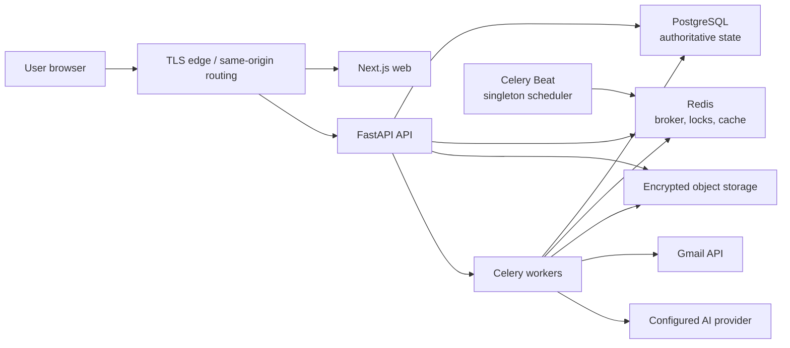
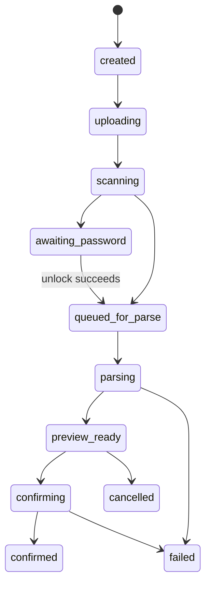
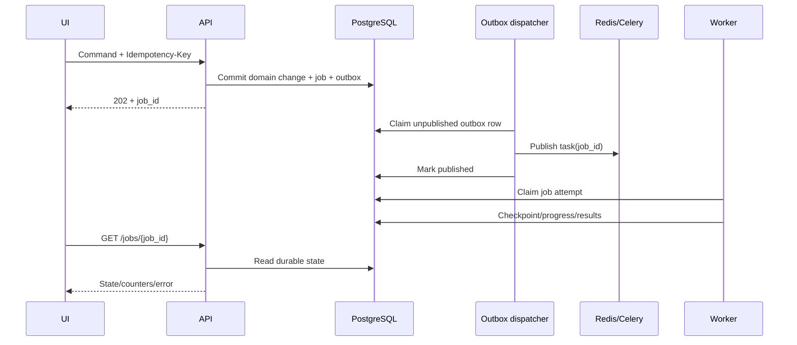
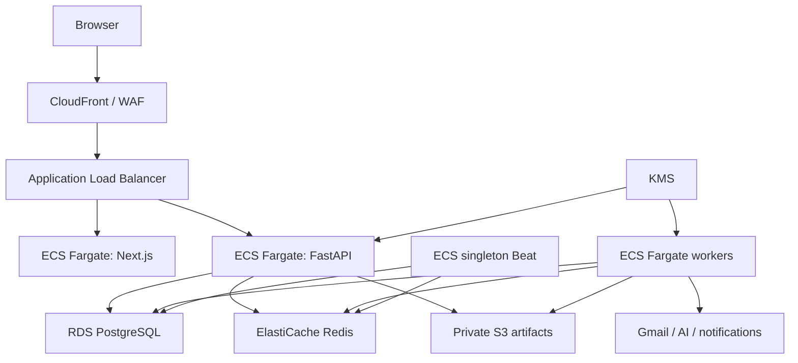

# Arcis technical architecture

Status: Proposed implementation contract  
Companion document: [PLAN.md](./PLAN.md)  
Initial deployment: Single user  
Design target: Multi-user capable, read-only financial data platform

## 1. Purpose and authority

This document turns the product and delivery plan into implementation-level
contracts. It defines component ownership, data invariants, APIs, asynchronous
workflows, security controls, deployment topology, and operational behavior.

`PLAN.md` is authoritative for scope, ordering, and acceptance criteria. This
document is authoritative for technical boundaries. When code needs to violate
one of these boundaries, create an architecture decision record (ADR), update
both documents, and then implement the change.

The architecture is deliberately a modular monolith. The web application, API,
and background-worker processes are deployed separately, but share one backend
codebase and one PostgreSQL database. This provides operational isolation
without creating distributed domain ownership prematurely.

## 2. Architecture goals

### 2.1 Primary goals

- Produce a correct, reproducible canonical transaction ledger.
- Preserve evidence and provenance across parser and matching changes.
- Make every ingestion and reconciliation operation idempotent.
- Isolate institution-specific parsing from core financial logic.
- Keep sensitive source content and credentials out of logs and AI requests.
- Support asynchronous, retryable Gmail, document, reconciliation, and
  analytics work.
- Keep API and database ownership ready for multiple users even though the
  first deployment has one.
- Let users understand and correct uncertain decisions.
- Make failures visible, recoverable, and safe to replay.

### 2.2 Initial non-functional targets

These are engineering targets, not a commercial availability commitment:

| Area | Initial target |
| --- | --- |
| Ledger correctness | All totals reproducible from canonical transactions and versioned classification state |
| Automatic reconciliation | Favor precision; never auto-match below the calibrated acceptance threshold |
| Common read APIs | p95 under 300 ms on the reference dataset, excluding network latency |
| Warm overview load | Usable content under 2 seconds on a typical broadband connection |
| Job acknowledgement | API returns a durable job ID within 1 second |
| Job pickup | 95% of normal-priority jobs start within 30 seconds |
| Initial scale fixture | 500,000 canonical transactions and 1,000,000 source records for one user |
| Backup recovery point | At most 24 hours of database data in the initial personal deployment |
| Backup recovery time | Restore service within 4 hours using the documented runbook |
| Accessibility | WCAG 2.2 AA for core workflows |

Targets must be measured using sanitized fixtures in CI or a repeatable
performance environment.

### 2.3 Explicit non-goals

- A full double-entry accounting system
- Payment initiation or transaction mutation at a bank
- Real-time balance guarantees
- Generic SQL generation by an LLM
- Microservices in the MVP
- Cross-currency aggregation without an explicit exchange-rate policy
- Keeping Redis or an object-store listing as an authoritative financial record

## 3. System context and trust boundaries



### 3.1 Trust boundaries

1. **Browser boundary.** Browser input is untrusted. Authorization is enforced
   by the API, never by hidden UI controls.
2. **API boundary.** FastAPI is the public policy enforcement point. It owns
   application authentication, user scoping, validation, command
   idempotency, and audit creation.
3. **Worker boundary.** Workers run institution parsers and integrations on
   untrusted email/document data. They use narrow domain services and do not
   bypass ownership checks or write reporting projections directly.
4. **Parser boundary.** Parser output is untrusted until validated against the
   common contract. A parser does not create canonical transactions.
5. **Redis boundary.** Redis is non-authoritative. Loss of Redis may delay
   work or clear caches, but must not lose committed financial state.
6. **Object-storage boundary.** Object bytes are private and encrypted.
   PostgreSQL contains authoritative metadata, content hashes, ownership, and
   lifecycle state.
7. **External-provider boundary.** Gmail, notification services, and AI
   providers are external processors. Requests are minimized, timed out,
   retried only when safe, and audited without sensitive payloads.
8. **LLM boundary.** Model output is untrusted. It cannot query the database
   directly, set user identity, select arbitrary tools, or author financial
   totals.

### 3.2 Authoritative ownership

| Data | Authority |
| --- | --- |
| Users, sessions, ownership | PostgreSQL |
| Mailbox cursor and sync history | PostgreSQL |
| Artifact metadata and hash | PostgreSQL |
| Artifact bytes | Encrypted object storage |
| Parser run and source records | PostgreSQL |
| Canonical transactions and evidence links | PostgreSQL |
| Category, merchant, reconciliation, feedback | PostgreSQL |
| Durable job state and counters | PostgreSQL |
| Celery delivery, locks, ephemeral cache | Redis |
| Reports shown to users | Recomputed from PostgreSQL or versioned cache entries |
| AI prose | PostgreSQL only after validation, with evidence and prompt/model version |

## 4. Repository structure

Use a source monorepo:

```text
arcis/
├── apps/
│   ├── web/                    # Next.js TypeScript application
│   └── api/                    # FastAPI entrypoint and HTTP composition
├── packages/
│   ├── backend/                # Python domain/application/infrastructure package
│   ├── contracts/              # Pydantic API, parser, event, and tool contracts
│   ├── parsers/                # Institution adapters and parser registry
│   ├── frontend-client/        # Generated TypeScript API client
│   └── ui/                     # Optional shared UI primitives
├── migrations/                 # Alembic migrations
├── fixtures/
│   ├── sanitized/              # Versioned parser/reconciliation fixtures
│   └── synthetic/              # Scale and performance data
├── tests/
│   ├── unit/
│   ├── integration/
│   ├── contract/
│   ├── replay/
│   ├── e2e/
│   └── performance/
├── deploy/
│   ├── compose/                # Local Docker Compose
│   ├── aws/                    # Infrastructure as code
│   └── observability/
├── scripts/                    # Reproducible developer/release commands
├── docs/
│   ├── PLAN.md
│   ├── ARCHITECTURE.md
│   ├── NEXT.md                 # Added before implementation
│   ├── STATUS.md               # Added before implementation
│   └── adr/
├── .env.example                # Names only; no usable credentials
└── README.md
```

### 4.1 Dependency rules

The backend follows inward dependencies:

```text
API / Celery entrypoints
        ↓
application services and commands
        ↓
domain models and policies
        ↑
repositories / Gmail / storage / AI adapters
```

- Domain modules do not import FastAPI, Celery, Gmail SDKs, SQLAlchemy models,
  or AI provider SDKs.
- Institution parsers depend on parser contracts, not transaction
  repositories.
- API response schemas are not ORM entities.
- Cross-module writes go through an application service.
- Reporting queries may use optimized read models but must preserve the same
  user scope and classification semantics as domain queries.

### 4.2 Toolchain decisions

Exact package managers are finalized in Phase 0, but the reproducibility rules
are fixed:

- Pin direct dependencies and commit lockfiles.
- Use one supported Python minor across API, workers, CI, and local containers.
- Generate the TypeScript client from the committed OpenAPI schema.
- Fail CI when generated contracts or migrations drift.
- Use UTC in containers and explicit `Asia/Kolkata` user settings for
  financial date boundaries.
- Build immutable containers identified by source commit and dependency lock
  hash.

## 5. Runtime components

### 5.1 Next.js web application

Responsibilities:

- Server-rendered application shell and authenticated routing.
- Ledger, account, import, review, report, insight, and assistant views.
- User input validation for immediate feedback.
- Polling durable job resources and showing progress/errors.
- Accessible charts with tabular alternatives.

The browser never receives OAuth refresh tokens, file-storage credentials,
database identifiers belonging to other users, or raw unredacted source
documents unless the user explicitly opens an authorized document-view
endpoint.

### 5.2 FastAPI API

Responsibilities:

- Authentication, session lifecycle, and CSRF enforcement.
- Ownership and authorization.
- REST API validation and versioning.
- Command idempotency.
- Database transactions.
- Creation of durable jobs and transactional outbox records.
- Safe artifact upload/download orchestration.
- OpenAPI generation.
- Audit events.

Slow Gmail, parsing, reconciliation, report, notification, and AI operations do
not execute inside normal request handlers.

The one exception is protected-PDF unlock: the API invokes a bounded isolated
parser subprocess while the HTTPS request remains open, because the plaintext
password may not be persisted or sent through the task broker. The subprocess
returns extracted/decrypted bytes or structured failure within a strict
timeout; subsequent normalization remains asynchronous.

### 5.3 Celery workers

Workers are separate processes built from the backend image:

| Queue | Work |
| --- | --- |
| `ingestion` | Gmail discovery, message fetch, attachment capture, structured imports |
| `parsing` | Email/PDF/CSV/XLSX parser execution and source-record validation |
| `reconciliation` | Candidate generation, matching, relation detection |
| `analytics` | Categorization, recurring series, anomalies, forecasts, reports |
| `notifications` | Reminder delivery and delivery retries |
| `maintenance` | Retention, key rotation support, reprocessing, projection rebuilds |

Workers have only the credentials needed for their queue. Document parsers
have no general outbound network permission in production.

### 5.4 Celery Beat

Run one scheduler instance. Scheduled tasks acquire a PostgreSQL advisory lock
or lease before creating jobs so an accidental second Beat instance cannot
duplicate schedules. Beat creates durable job/outbox rows; it does not make
provider calls directly.

### 5.5 PostgreSQL

PostgreSQL is authoritative for durable application state. Use migrations for
every schema change. Reporting replicas and partitioning are deferred until
measured need.

### 5.6 Redis

Redis provides:

- Celery broker/result transport
- Distributed mailbox/job locks with fencing tokens
- Short-lived response caches
- Rate-limit counters

Durable job status remains in PostgreSQL. Code must tolerate an empty cache.

### 5.7 Object storage

Local development uses an S3-compatible service. Production uses a private S3
bucket with:

- Block Public Access
- Versioning
- Server-side encryption with a customer-managed key
- Lifecycle policies matching the application retention state
- Random object keys with no user, bank, account, or filename PII
- Access only through API/worker roles

## 6. Domain modules

```text
identity
mailboxes
accounts
artifacts
imports
parsers
ledger
reconciliation
merchants
categories
cards
budgets
analytics
insights
assistant
notifications
audit
privacy
jobs
```

Each module contains:

- Domain types and invariants
- Application commands/queries
- Repository interfaces
- Infrastructure adapters
- API schemas/routes where applicable
- Unit and contract tests

No module stores a second independent representation of a financial amount
without declaring its source and calculation version.

## 7. Core data architecture

### 7.1 Identifier and column conventions

- Primary keys are UUIDs generated by the application.
- All user-owned rows include `user_id`, even in the single-user release.
- Durable rows have `created_at` and `updated_at` UTC timestamps.
- Mutable user-facing resources include integer `version` for optimistic
  concurrency.
- Money uses positive `NUMERIC(20, 4)` plus `currency CHAR(3)` and a
  `direction` enum (`debit`, `credit`). Display precision follows currency.
- Financial dates are PostgreSQL `DATE`; instants are `TIMESTAMPTZ`.
- JSONB is allowed for provider metadata, parser diagnostics, and versioned
  evidence, not as a substitute for indexed core columns.
- Soft deletion is used only where recovery/audit requires it. Privacy erasure
  uses a dedicated deletion workflow.

### 7.2 Identity tables

`users`

| Column | Notes |
| --- | --- |
| `id` | Primary key |
| `email_normalized` | Unique login identifier |
| `display_name` | User-controlled |
| `password_hash` | Argon2id hash; never returned |
| `default_currency` | Initial value `INR` |
| `timezone` | IANA zone, initially `Asia/Kolkata` |
| `status` | `active`, `locked`, `deleting`, `deleted` |
| `created_at`, `updated_at` | UTC |

`sessions`

| Column | Notes |
| --- | --- |
| `id` | Primary key |
| `user_id` | Indexed foreign key |
| `token_hash` | Unique hash of opaque browser token |
| `csrf_secret_hash` | Hash or verifier for unsafe requests |
| `created_at`, `last_seen_at` | UTC |
| `idle_expires_at`, `absolute_expires_at` | Enforced by API |
| `revoked_at`, `revoke_reason` | Nullable |
| `ip_prefix_hash`, `user_agent_hash` | Optional abuse signals, not raw values |

### 7.3 Mailbox and credential tables

`mailboxes`

- `id`, `user_id`
- Provider (`gmail` initially)
- Provider subject/account identifier
- Display email
- Connection status
- Granted-scope set
- Current history cursor
- Initial-sync start date
- Last attempted/successful sync
- Cursor-invalidated timestamp
- Health and parser counters
- `version`, timestamps

Unique constraint: `(user_id, provider, provider_subject)`.

`oauth_credentials`

- `mailbox_id`
- Encrypted refresh token ciphertext
- Nonce/authentication tag
- Key version
- Provider token metadata
- Created, rotated, revoked timestamps

Access tokens are memory-only. Refresh-token plaintext never enters logs,
traces, job arguments, or API responses.

### 7.4 Financial-account tables

`financial_institutions`

- Stable institution code
- Name
- Country
- Supported adapter capabilities

`financial_accounts`

- `id`, `user_id`, institution
- Type: `bank_account` or `credit_card`
- Product name and user display name
- Masked identifier and last digits only
- Currency
- Status
- Credit-card statement-cycle fields where applicable
- Last verified source and time
- `version`, timestamps

Do not store full account or card numbers unless a future integration strictly
requires them and an ADR adds the necessary controls. Parser association uses
configured account aliases, masked digits, institution/product, and user
confirmation.

`account_source_aliases`

- Financial account
- Source type/mailbox/parser
- Normalized alias or masked identifier
- Confidence and confirmation source

Unique constraints prevent the same confirmed source alias mapping to two
accounts for one user.

`balance_observations`

- Financial account
- Amount, currency
- Observation time
- Source record or statement
- Confidence

Balances are observations. The application never labels one “current” without
showing its timestamp and source.

### 7.5 Artifact and parser tables

`source_artifacts`

- `id`, `user_id`
- Kind: `gmail_message`, `gmail_attachment`, `manual_upload`, `manual_entry`
- Mailbox/import parent
- Provider message/attachment identifier
- Original filename after sanitization
- Detected MIME type and byte size
- SHA-256 content hash
- Random object-store key
- Encryption/key metadata reference
- Artifact lifecycle state
- Retention/delete timestamps
- Timestamps

Uniqueness:

- Gmail message: `(mailbox_id, provider_message_id)`
- Gmail attachment: `(mailbox_id, provider_message_id, provider_attachment_id)`
- Manual upload: `(user_id, import_id, content_sha256)`

Content hash alone is not globally unique and never establishes cross-user
ownership.

`parser_runs`

- Artifact
- Parser adapter identifier and semantic version
- Parser configuration hash
- State and timing
- Output schema version
- Safe warning/error codes
- Record count

Unique constraint:
`(artifact_id, parser_id, parser_version, configuration_hash)`.

`source_records`

- `id`, `user_id`, parser run, artifact
- Stable record key or ordinal
- Financial account candidate
- Transaction/posted date
- Positive amount, currency, direction
- Original narration in encrypted/sensitive storage where required
- Redacted narration for normal UI/search
- Provider reference
- Merchant candidate
- Record kind
- Parser confidence
- Normalized payload schema version
- Review state
- Timestamps

Source records are immutable observations. A corrected parse creates a new
parser run/source record version; it does not mutate historical evidence.

`discovered_financial_accounts`

- `user_id`, originating mailbox, and stable product fingerprint
- Institution, account type, masked last four digits, and currency
- Suggested product/display names that the user can correct
- State: `pending`, `confirmed`, or `rejected`
- Optional canonical `financial_account_id` after confirmation
- First/last detection and decision timestamps

The initial fingerprint is
`institution:account_type:last_four`. It is derived only from supported,
deterministically parsed alerts and never from an LLM. A pending discovery is
a quarantine boundary: linked parser candidates cannot create source records,
transactions, balances, spending, or insights. Confirmation creates or links
the canonical financial account and materializes the quarantined candidates
idempotently. Rejection is durable; later alerts with the same fingerprint are
marked rejected without entering the ledger. Users may explicitly reconsider a
rejection.

### 7.6 Canonical ledger tables

`transactions`

- `id`, `user_id`, financial account
- Transaction and posted dates
- Positive amount, currency, direction
- Transaction kind:
  `purchase`, `income`, `fee`, `refund`, `cash_withdrawal`, `transfer`,
  `card_payment`, `investment`, `adjustment`, `unknown`
- Original/redacted narration reference
- Merchant
- Parent category and optional subcategory as separate foreign keys. Tagging
  choices are ranked deterministically from transaction-text relevance and
  per-user historical usage; search matches both taxonomy levels.
- Reconciliation state
- Categorization source/confidence
- User review state
- Canonicalization version
- `version`, timestamps

A canonical fingerprint is indexed for candidate lookup but is not unique:
legitimate transactions can share account, amount, date, and merchant.

`transaction_evidence`

- Canonical transaction
- Source record
- Relationship: `primary`, `confirming`, `reversal_evidence`,
  `refund_evidence`
- Match method and algorithm version
- Score and feature explanation
- Automatic or reviewed decision
- Reviewer/timestamp

A source record can support at most one non-reversal canonical transaction.
One canonical transaction may have multiple source records.

`transaction_relations`

- From/to canonical transaction
- Type: `owned_transfer`, `card_payment`, `refund_of`, `reversal_of`,
  `duplicate_of`
- Confidence, algorithm version
- Automatic/review decision

Relations do not merge the two account-local legs. Spending reports exclude
the appropriate kinds/relations; cash-flow views retain them.

`transaction_revisions`

- Transaction
- Changed field set
- Previous/new safe values
- Actor and reason
- Timestamp

Source provenance and manual correction history remain separate.

### 7.7 Statement tables

`statements`

- `id`, `user_id`, financial account, artifact
- Statement period start/end
- Opening and closing balance
- Statement amount, minimum due, due date
- Credit/available limit observations
- Parser run
- Reconciliation state and summary
- `version`, timestamps

`statement_entries`

- Statement
- Source record
- Sequence and statement-specific reference

A statement period may overlap another imported statement. Duplicate
statements are linked/reviewed rather than silently discarded.

Institution adapters must scope consolidated documents to the financial
product being imported before producing normalized rows. For SBI consolidated
statements, Savings/SB sections are eligible for a savings-account import;
Demand Loan and Term Loan sections, including DL/TL abbreviations, are excluded
from transaction extraction and balance metadata.

### 7.8 Classification and merchant tables

`merchants`

- `id`, `user_id` nullable for system-known merchants
- Canonical name
- Search-normalized name
- Status and timestamps

`merchant_aliases`

- Merchant
- Alias pattern or normalized value
- Match type: exact, prefix, regex, embedding
- Source: system, user, learned
- Priority, confidence, active range

User rules always outrank learned/system aliases. Regex rules have safety and
complexity limits.

`categories`

- `id`, `user_id` nullable for protected system categories
- Parent category
- Stable semantic code
- Display name, color/icon, active state

`category_rules`

- User
- Priority
- Predicate AST with allow-listed fields/operators
- Target category/subcategory
- Active state and version

Rules are stored as a validated predicate structure, never executable code or
SQL.

`category_assignments`

- Transaction
- Category/subcategory
- Source: user rule, merchant map, correction history, model, LLM, manual
- Confidence
- Rule/model/prompt version
- Active interval

Only one assignment is active per transaction.

### 7.9 Analytics tables

`recurrence_series` and `recurrence_members`

- Series type, merchant, expected interval, amount distribution
- Next expected date range
- Confidence and algorithm version
- User confirmation state
- Member transactions

`anomalies` and `anomaly_evidence`

- Anomaly type, severity, feature values, baseline period
- Algorithm version and generated time
- Supporting transaction/category/merchant references
- User feedback state

`budgets`

- User, period rule, category/account scope
- Amount/currency
- Alert thresholds and active interval

`insight_reports`

- User, reporting period
- Deterministic metrics payload and calculation version
- Validated AI narrative, provider/model/prompt version
- Evidence references
- Generation state and timestamps

### 7.10 Assistant and notification tables

`assistant_threads`, `assistant_messages`, `assistant_tool_runs`

- User ownership
- Redacted user/model content
- Tool name and schema version
- Validated arguments
- Bounded result summary and evidence IDs
- Provider/model/prompt version
- Timing, cost metadata, status

`notifications`, `notification_rules`, `notification_deliveries`

- User rule, event type, channel, local delivery time
- Deduplication key
- Optional allow-listed action kind and JSON payload containing only safe
  internal identifiers
- Scheduled/sent/failed timestamps and safe provider result

Unique delivery keys prevent a retry from sending the same reminder twice.
Actionable bank-statement notifications may reference a privately stored PDF
artifact and a safely inferred savings account. The UI must request the PDF
password at action time. A notification may contain normalized, non-secret
guidance derived from the email, such as “Use your Customer ID” or a date format,
but must never contain an explicit password, customer/account identifier, or
other credential value. Entered passwords are ephemeral request data and are
never persisted or logged. Source artifacts are internal evidence and are not
exposed through a general-purpose document browser.

### 7.11 Job, outbox, and audit tables

`jobs`

- `id`, `user_id`, kind
- State: `queued`, `running`, `waiting_for_user`, `succeeded`,
  `partially_succeeded`, `failed`, `cancelled`
- Idempotency key and request correlation ID
- Parent/child job
- Progress counters and phase
- Checkpoint
- Attempt/max-attempt values
- Safe error code and recoverability
- Started/completed timestamps

Unique constraint: `(user_id, job_kind, idempotency_key)` for active/reusable
commands.

`outbox_events`

- Event type and schema version
- Aggregate/user/job identifier
- Safe payload
- Created, published, attempt, and next-attempt timestamps

An API command commits domain state, job state, and outbox event in one
transaction. A dispatcher publishes pending events to Celery. Duplicate
delivery is expected and safe.

`audit_events`

- User/actor type and actor ID
- Action and target
- Request/job correlation ID
- Result
- Safe metadata
- Timestamp

Application roles can append but not update audit rows. Sensitive contents,
tokens, passwords, and full narration never belong in audit metadata.

## 8. Data invariants

The following invariants are enforced in domain logic and, where possible,
database constraints:

1. Every owned record resolves to exactly one user.
2. An artifact cannot be processed under a different user than its mailbox or
   import.
3. Amount is positive; direction carries debit/credit meaning.
4. Reports never sum source records.
5. A source record is immutable after creation.
6. Parser reprocessing creates a new run and does not implicitly replace
   accepted evidence.
7. A source record cannot confirm two unrelated canonical transactions.
8. A transfer or card payment keeps both account-local transaction legs.
9. Refunds and reversals are related transactions, not destructive edits to
   the original.
10. A user correction supersedes an inferred assignment without deleting its
    history.
11. Redis loss cannot delete committed work or change ledger totals.
12. AI prose cannot alter amount, date, direction, reconciliation, or report
    calculations.
13. Deleting an artifact cannot silently delete a canonical transaction; it
    changes evidence availability through an explicit privacy workflow.
14. Every automatic decision stores the algorithm/rule/model version and
    confidence.

## 9. Contracts and versioning

### 9.1 Contract package

`packages/contracts` contains Pydantic models for:

- API commands and responses
- Parser input metadata and output
- Job progress and failure codes
- Reconciliation decisions
- Analytics tool input/output
- AI structured output
- Outbox event payloads

Generate JSON Schema and the TypeScript client from these models. CI compares
the generated artifacts with committed output.

### 9.2 Parser contract

Conceptual output:

```text
ParsedDocument
  schema_version
  parser_id
  parser_version
  artifact_id
  institution_code
  document_kind
  account_candidates[]
  statement_summary?
  records[]
  warnings[]

ParsedRecord
  source_record_key
  transaction_date
  posted_date?
  amount
  currency
  direction
  narration
  provider_reference?
  masked_account_hint?
  merchant_hint?
  record_kind
  confidence_by_field
  source_location
```

`source_location` identifies an email section, CSV row, worksheet/row, or PDF
page/line region without exposing content in logs.

Parsers:

- Are deterministic for the same bytes/configuration/version.
- Return typed warnings rather than logging document content.
- Do not query or mutate the canonical ledger.
- Reject unknown currency/amount/date ambiguity unless explicitly represented
  as a reviewable field error.
- Include golden fixtures for every supported template.

### 9.3 Compatibility

- REST breaking changes require a new API major path.
- New optional fields and enum values require tolerant frontend handling.
- Outbox and parser contracts include schema versions.
- Workers reject unsupported major schema versions and leave the job
  recoverable.
- Database migrations support rolling API/worker deployment when production
  availability requires it.

## 10. REST API

### 10.1 Conventions

- Base path: `/api/v1`
- JSON uses ISO 8601 and explicit currency strings.
- Errors use `application/problem+json` with stable `type`, `code`, `status`,
  `title`, safe `detail`, `request_id`, and field errors.
- Commands that can be retried accept/require `Idempotency-Key`.
- Mutable resources use `ETag`/version and `If-Match` where lost updates matter.
- Lists use keyset pagination with opaque cursors.
- Date filters use the user's financial timezone unless an explicit timezone is
  supplied.
- Sensitive API responses send `Cache-Control: no-store`.
- OpenAPI is generated in CI and used to generate the frontend client.

### 10.2 Authentication routes

```text
POST   /auth/login
POST   /auth/logout
POST   /auth/logout-all
GET    /auth/session
POST   /auth/password/change
```

Login is rate-limited and returns only a secure opaque cookie. No bearer token
is placed in browser storage.

### 10.3 Mailbox routes

```text
GET    /mailboxes
POST   /mailboxes/gmail/authorize
GET    /mailboxes/gmail/callback
POST   /mailboxes/{mailbox_id}/sync
POST   /mailboxes/sync
GET    /mailboxes/{mailbox_id}/sync-history
POST   /mailboxes/{mailbox_id}/disconnect
DELETE /mailboxes/{mailbox_id}
```

OAuth `state` is bound to the current session and a PKCE verifier. The
callback validates provider subject, state, and redirect binding before
persisting an encrypted refresh token.

### 10.4 Account and card routes

```text
GET    /financial-accounts
POST   /financial-accounts
PATCH  /financial-accounts/{account_id}
DELETE /financial-accounts/{account_id}
```

`PATCH` edits user-facing product details while keeping institution and account
type immutable. `DELETE` is a soft removal: it archives the product, removes it
from active account/card views, and suppresses future Gmail alerts for a linked
discovery. Existing source evidence and accepted ledger history remain
available for audit and historical reporting.

### 10.5 Import and artifact routes

```text
POST   /imports
POST   /imports/{import_id}/files
POST   /imports/{import_id}/unlock
POST   /imports/{import_id}/parse
GET    /imports/{import_id}
GET    /imports/{import_id}/preview
POST   /imports/{import_id}/confirm
POST   /imports/{import_id}/cancel
POST   /imports/{import_id}/reprocess
GET    /imports
GET    /artifacts/{artifact_id}/metadata
GET    /artifacts/{artifact_id}/content
DELETE /artifacts/{artifact_id}
```

Uploads are streamed with size limits, MIME/magic validation, hashing, malware
scanning policy, and random storage keys. Original filenames are not object
keys.

### 10.6 Ledger and review routes

```text
GET    /transactions
POST   /transactions
GET    /transactions/{transaction_id}
PATCH  /transactions/{transaction_id}
GET    /transactions/{transaction_id}/evidence
GET    /transactions/{transaction_id}/revisions
POST   /transactions/{transaction_id}/relations
GET    /review-items
GET    /review-items/{review_id}
POST   /review-items/{review_id}/resolve
POST   /review-items/bulk-resolve
```

Bulk resolution has a strict item limit and validates ownership for every item.

### 10.7 Classification, analytics, and insight routes

```text
GET    /categories
POST   /categories
PATCH  /categories/{category_id}
GET    /category-rules
POST   /category-rules
PATCH  /category-rules/{rule_id}
GET    /merchants
PATCH  /merchants/{merchant_id}
GET    /analytics/overview
GET    /analytics/spending-by-category
GET    /analytics/trends
GET    /analytics/merchants
GET    /recurring-payments
GET    /anomalies
POST   /anomalies/{anomaly_id}/feedback
GET    /insight-reports
POST   /insight-reports/generate
```

### 10.8 Assistant and job routes

```text
GET    /assistant/threads
POST   /assistant/threads
GET    /assistant/threads/{thread_id}
POST   /assistant/threads/{thread_id}/messages
DELETE /assistant/threads/{thread_id}
GET    /jobs/{job_id}
POST   /jobs/{job_id}/cancel
GET    /jobs
```

The MVP uses polling with conditional requests for job progress. Server-sent
events can be added later without changing durable job semantics.

### 10.9 Privacy routes

```text
GET    /privacy/export
POST   /privacy/export
GET    /privacy/retention
PATCH  /privacy/retention
POST   /privacy/delete-account
GET    /audit-events
```

Export and deletion are asynchronous jobs with step-by-step status.

## 11. Frontend architecture

### 11.1 Rendering and state

- Use Next.js App Router.
- Render authenticated layout and stable page shells on the server.
- Use client components for charts, filters, import mapping, review resolution,
  polling, and assistant interaction.
- Use the generated API client for all HTTP contracts.
- Use a query cache for server state; do not mirror ledger data into a global
  client store.
- Store filters in URL search parameters where practical.
- Do not put transactions, narrations, source content, or tokens in
  `localStorage`.

### 11.2 UI data rules

- Format money with `Intl.NumberFormat`, explicit currency, and user locale.
- Distinguish transaction date from posted date.
- Show data-source timestamp beside balances.
- Show loading, empty, partial, stale, error, and permission states.
- Charts have accessible summaries and table views.
- Evidence and confidence are visible from ledger/review views without
  exposing raw sensitive content by default.
- Optimistic UI is limited to reversible preferences; financial corrections
  wait for the API result.

### 11.3 Routes

```text
/overview
/transactions
/spending
/accounts
/accounts/[id]
/cards
/cards/[id]
/imports
/imports/[id]
/review
/insights
/assistant
/settings/mailboxes
/settings/privacy
/settings/audit
```

### 11.4 Browser security

- Same-origin web/API routing in production.
- Content Security Policy with no unsafe script execution.
- `frame-ancestors 'none'` unless an explicit embedding use case appears.
- HTTPS-only secure cookies.
- No permissive production CORS.
- Escape all narration/merchant/user strings.
- Artifact downloads use short-lived, authorization-checked API responses.

## 12. Authentication and authorization

### 12.1 Application session

The MVP uses backend-owned opaque sessions:

- At least 256 bits of random token entropy.
- Cookie name with `__Host-` prefix where deployment permits.
- `Secure`, `HttpOnly`, `SameSite=Lax`, and `Path=/`.
- Only a hash of the token is stored.
- Default 30-minute idle expiry and 12-hour absolute expiry, configurable by
  environment.
- Session rotation after login/password change and privilege-sensitive events.
- Logout revokes the server record.

Password hashes use Argon2id with parameters benchmarked on the deployment
class. Password reset is not exposed until a secure recovery channel exists;
the initial personal deployment has a documented local administrative recovery
procedure.

### 12.2 CSRF and request integrity

- Unsafe cookie-authenticated methods require a CSRF token and same-origin
  `Origin`/`Referer` validation.
- OAuth callback state is single-use and session-bound.
- Idempotency keys are user-bound and request-body-hash-bound.
- `If-Match` prevents stale manual corrections.

### 12.3 Ownership

Every repository method takes authoritative `user_id` from the session/job
context. It is never accepted from assistant output or a normal request body.

Application checks are mandatory. PostgreSQL row-level security is recommended
as defense in depth before any second production user; Phase 0 decides whether
it is enabled immediately.

Background jobs store user ownership in the durable job. Workers load it from
PostgreSQL and never trust a free-form Celery argument for authorization.

## 13. Gmail ingestion

### 13.1 OAuth

- Request only the minimum read scope confirmed in the Phase 0 spike.
- Use authorization code flow with PKCE and state.
- Encrypt refresh tokens at rest.
- Keep access tokens in memory only.
- Treat disconnect and application data deletion separately: disconnect
  revokes/removes credentials; deletion follows retention policy.
- Do not log message subjects, bodies, sender names, or tokens.

### 13.2 Initial synchronization

1. Acquire a fenced per-mailbox lock.
2. Create/load a durable sync job.
3. Determine the bounded initial lookback chosen by the user.
4. Search/list candidate messages using known sender/subject rules.
5. Persist message metadata/artifacts idempotently.
6. Enqueue parser work only after artifact commit.
7. Capture a safe history cursor/checkpoint.
8. Update counters and release the lock.

The initial sync does not claim completeness outside its selected lookback.

### 13.2a Financial-product discovery and approval

1. The user connects Gmail; no financial account is required beforehand.
2. A bounded background discovery job searches only allowlisted institution
   domains and persists matching artifacts idempotently. Sender validation
   requires an exact bank domain or one of its subdomains; substring matches
   are not trusted.
3. A deterministic product detector derives institution, bank-account/card
   type, and ending four digits from explicit transaction body context. It
   never uses starting digits, customer IDs, or debit-card digits as a
   bank-account identity. It is intentionally independent of full transaction
   normalization, so a known product can be offered for confirmation even
   when that alert layout is not yet supported. A declined card transaction
   can establish product identity but cannot enter the ledger. The unsupported
   transaction itself remains quarantined.
4. Arcis upserts one user-scoped product discovery and links all matching
   parser candidates to it.
5. The user confirms suggested details or rejects the product.
6. Confirmation creates the canonical account and imports its quarantined
   candidates; future matching alerts materialize automatically.
7. Rejection keeps both current and future linked candidates out of the
   canonical ledger until the decision is explicitly reconsidered.

The Gmail scan runs through Celery and durable job state so HTTP requests do
not remain open while years of provider history are fetched. Product
fingerprints are global to the Arcis user rather than mailbox-local, preventing
the same product from being presented twice when alerts are forwarded to
multiple connected mailboxes.

Privacy-safe template observations and the exact product-identity rules are
maintained in [EMAIL_FORMATS.md](./EMAIL_FORMATS.md).

### 13.3 Incremental synchronization

1. Acquire the mailbox lock.
2. Read the committed history cursor.
3. Enumerate provider history pages.
4. Fetch relevant added/changed messages.
5. Persist artifacts using provider IDs.
6. Commit page checkpoint only after its artifacts are durable.
7. Advance the mailbox cursor after all pages succeed.

If the history cursor is invalid, create a bounded recovery scan from the last
successful sync minus a safety overlap. Provider IDs and content hashes make
the overlap idempotent.

### 13.4 Gmail artifact policy

Persist:

- Provider message and attachment IDs
- Mailbox ownership
- Received timestamp
- Institution/template routing metadata
- Content hash
- Encrypted relevant MIME content/attachment only when retention policy permits

Do not persist unrelated mailbox content. Sender/subject metadata displayed for
review is treated as sensitive. Unsupported messages get a safe error code and
protected review item.

### 13.5 Concurrency and recovery

- One active discovery sync per mailbox.
- Repeated **Sync Now** returns the existing active job.
- Provider calls use bounded exponential backoff with jitter.
- Authentication failures stop retries and mark the mailbox for reconnection.
- Rate-limit failures are recoverable and retain the cursor.
- A partially parsed mailbox sync may be `partially_succeeded`; discovered
  artifacts remain durable and parser failures become review items.

## 14. File import and parser execution

### 14.1 Upload states



### 14.2 Upload controls

- Stream uploads; do not read arbitrary files fully into API memory.
- Apply configurable byte, page, row, worksheet, compression-ratio, and
  processing-time limits.
- Validate filename extension, declared MIME, and detected magic bytes.
- Reject macro-enabled spreadsheets in the MVP.
- Disable external links/formulas when reading spreadsheets.
- Use parser libraries in non-executing modes.
- Scan according to the deployment malware policy before parsing.
- Keep temporary paths randomized and erase them after the operation.

### 14.3 Protected PDF handling

The password is accepted only by `POST /imports/{id}/unlock` over TLS:

1. Verify session, CSRF, import ownership, state, and rate limit.
2. Read encrypted artifact bytes through an authorized stream.
3. Pass bytes and password through stdin/private pipes to a sandboxed parser
   subprocess. They never enter command-line arguments or environment
   variables.
4. Apply CPU, memory, file, and wall-clock limits with no outbound network.
5. Persist only decrypted extraction output or a newly encrypted unlocked
   artifact according to retention policy.
6. Close pipes, terminate the process, zero/replace buffers where practical,
   and return a safe result.

The password is absent from PostgreSQL, object storage, Redis, Celery, logs,
traces, crash reports, and audit metadata.

### 14.4 Preview and confirmation

Preview reads source records, proposed account mapping, validation warnings,
and candidate matches. It does not affect reports.

Confirmation:

- Requires the import version through `If-Match`.
- Uses a user/idempotency key.
- Creates evidence links and canonical transactions in bounded database
  transactions.
- Records review items instead of accepting uncertain matches.
- Is safe to resume after interruption.
- Marks the import confirmed only when all batches reach a terminal state.

## 15. Reconciliation and deduplication

### 15.1 Candidate generation

Generate candidates only within the same user and financial account, then
block by:

- Currency
- Direction
- Exact amount for normal matches
- Appropriate date window
- Optional stable reference

Typical starting windows:

- Email alert to statement: transaction date ±3 days
- Posted date where known: ±1 day
- Transfer/card-payment relationship: configured cross-account window

These are calibrated per institution/record type using fixtures.

### 15.2 Matching hierarchy

1. Exact provider/source identity.
2. Exact normalized stable reference within account.
3. Deterministic composite match.
4. Weighted fuzzy match.
5. Manual review.

Example fuzzy features:

| Feature | Behavior |
| --- | --- |
| Account, currency, direction | Mandatory gate |
| Amount | Exact for confirmation; tolerance only for defined use cases |
| Transaction/posted date | Decaying score by distance |
| Reference number | Strong exact/normalized weight |
| Merchant | Token/alias similarity |
| Narration | Normalized similarity after removing volatile tokens |
| Source pair | Expected email/statement pairing bonus |

Initial policy proposal:

- Auto-match at score `>= 0.93`, provided the next candidate is at least `0.05`
  lower and no contradiction exists.
- Send scores `0.72–0.93` or close competing candidates to review.
- Below the review threshold, create a new canonical transaction.

These values are not production constants until Phase 0/Phase 3 evaluation
proves the required precision. Thresholds and weights are versioned.

### 15.3 Important edge cases

- Same merchant, amount, and date can be two legitimate purchases.
- Pending and posted card records may shift date.
- Tips, foreign-exchange settlement, and fuel/hotel holds may change amount.
- Refund and reversal amounts resemble duplicate credits but remain separate
  economic events related to the original.
- Statement descriptions may omit the email reference.
- Credit-card payment dates may differ between bank debit and card credit.
- Split transactions and EMI conversions require explicit adapter semantics.

No edge case is “resolved” by deleting source evidence.

### 15.4 Transfer and card-payment detection

Find cross-account pairs owned by the same user using opposite directions,
currency, amount, date window, references, and known payee/account hints.

- Bank-to-bank transfer: relation `owned_transfer`.
- Bank debit paying owned credit card: relation `card_payment`.
- Both legs stay in their account ledgers.
- Spending reports exclude the payment/transfer semantics.
- Cash-flow views can show both legs or collapse a related pair.
- Unpaired suspected transfers remain reviewable rather than disappearing from
  expenses automatically.

### 15.5 Rebuild behavior

Reconciliation output is rebuildable from source records, accepted manual
decisions, and algorithm versions. A new algorithm runs in shadow mode first
and reports decision differences. It does not replace accepted matches until a
migration/review operation is approved.

## 16. Categorization, merchant normalization, and analytics

### 16.1 Normalization

Normalization functions are versioned and deterministic:

- Unicode normalization and case folding
- Whitespace/punctuation normalization
- Removal of institution-specific volatile IDs
- Payment-rail token handling
- Merchant alias resolution

The original sensitive narration remains available only through protected
evidence access. Search uses a redacted/normalized field.

### 16.2 Categorization order

1. Explicit user correction
2. User category rule
3. Confirmed merchant mapping
4. Historical correction-derived mapping
5. Local embedding/classifier
6. External LLM structured classification, if enabled
7. Review queue

Each stage may accept, decline, or return a confidence. Lower stages cannot
override a higher-priority accepted decision.

### 16.3 Reporting semantics

All report queries:

- Filter by user.
- Use canonical transactions only.
- Apply the active categorization version.
- Exclude owned transfers and card-payment relations from expense totals.
- Treat refunds according to their relation/category and reporting period.
- State whether dates use transaction or posted date.
- Use account currency and refuse unsupported cross-currency totals.
- Return calculation version, date boundary, and generated time.

Materialized views or summary tables may optimize reports. They are versioned
projections and can be rebuilt from the ledger.

### 16.4 Forecasting

Forecasts consume deterministic aggregates, recurrence series, and time
boundaries. Store:

- Input window and feature version
- Algorithm/model version
- Point estimate and interval
- Generated/expiry times
- Evidence aggregate IDs

Do not present a forecast as a balance guarantee.

## 17. AI architecture

### 17.1 AI feature boundary

AI is optional per feature. Core import, ledger, reconciliation, manual
categorization, and reports work without an AI provider.

Allowed AI uses:

- Low-confidence merchant/category suggestions
- Natural-language explanation of computed anomaly candidates
- Monthly narrative from deterministic metrics
- Assistant tool selection and response synthesis

Disallowed:

- Raw SQL generation/execution
- Direct database credentials
- Unbounded tool calls
- Computing authoritative totals from raw documents
- Sending OAuth credentials, passwords, full email bodies, or statements
- Acting on instructions contained in emails, statements, merchant names, or
  transaction narration

### 17.2 Redaction and minimization

Build a typed AI input object from allow-listed fields. The redaction layer:

- Removes account/card digits beyond masked display needs.
- Removes references, email addresses, phone numbers, addresses, tokens, and
  free-form source content unless explicitly approved.
- Replaces transaction IDs with request-scoped opaque evidence handles.
- Sends aggregates instead of transaction lists when sufficient.
- Caps row count and date range.
- Records which field classes were sent, not their sensitive values.

Provider requests use the configured provider's data-control settings. The UI
shows a privacy summary before enabling cloud AI.

### 17.3 Prompt and output management

- Prompts are versioned source files.
- System policy is static and separate from evidence.
- Untrusted values are encoded as data fields, never concatenated as
  instructions.
- Structured outputs are schema-validated.
- One bounded repair attempt is allowed for invalid shape; otherwise fail
  closed.
- Store provider, model, prompt version, latency, token/cost metadata, and safe
  error code.
- Never store hidden reasoning.

### 17.4 Assistant tools

Allow-listed functions:

```text
get_spending_by_category
compare_periods
find_large_transactions
list_upcoming_bills
get_recurring_payments
forecast_month_end_spend
list_unreconciled_transactions
get_transaction_evidence_summary
```

Every tool:

- Has Pydantic input/output.
- Receives `user_id` from server context, never model arguments.
- Validates date ranges and currency.
- Applies row/amount/result limits.
- Returns evidence handles.
- Is audited.
- Has a timeout.

The orchestration loop has a small maximum number of tool calls. It stops on
repeated/invalid calls and returns a safe partial response.

### 17.5 Embeddings

Embeddings are deferred until merchant normalization evaluation shows a need.
If enabled, use PostgreSQL `pgvector` initially:

- Embed normalized/redacted merchant aliases, not raw documents.
- Store provider/model/dimension/version.
- Rebuild into a new version before switching reads.
- Keep user-specific embeddings user-scoped.
- Do not introduce a separate vector database for the MVP.

### 17.6 Evaluation

Run versioned offline evaluation before changing model, prompt, classifier, or
threshold:

- Category precision/recall/coverage
- Merchant normalization accuracy
- Assistant tool selection and argument validity
- Numeric answer agreement with deterministic query output
- Citation/evidence completeness
- Prompt-injection refusal
- Sensitive-field redaction

## 18. Background-job architecture

### 18.1 Creation and delivery



Celery messages contain identifiers and safe routing metadata, not tokens,
passwords, raw emails, statements, or transaction narrations.

### 18.2 Execution rules

- Tasks use late acknowledgement where safe.
- Workers expect duplicate delivery.
- Each logical step checks durable state before side effects.
- External calls use stable request/provider identifiers where supported.
- Retry only classified transient failures.
- Use exponential backoff with jitter and a maximum attempt count.
- Apply soft and hard time limits.
- Store safe error codes, not exception payloads that may contain source data.
- Unrecoverable failures create review/operational items.
- Cancellation is cooperative at checkpoints; committed work is not rolled
  back by deleting evidence.

### 18.3 Locks

Distributed locks include fencing tokens or are backed by PostgreSQL advisory
locks/leases. A process that resumes after losing a lease cannot commit a stale
cursor or terminal job state.

Required serialized scopes:

- Gmail discovery per mailbox
- Import confirmation per import
- Reconciliation per account/statement period
- Projection rebuild per user/projection version
- Scheduled notification per deduplication key

### 18.4 Job progress

Standard counters:

- `discovered`
- `processed`
- `created`
- `matched`
- `duplicates`
- `review_required`
- `failed`
- `skipped`

Progress is phase-based, not a fabricated percentage when total work is
unknown.

## 19. Cache and projection strategy

- Cache only derived, user-scoped responses.
- Cache keys include user, query dimensions, ledger projection version, and
  category version.
- Transaction/import/reconciliation changes increment a user ledger version.
- Category changes increment a classification version.
- Stale caches are harmless because versioned keys stop being read.
- Redis eviction must not affect correctness.
- Materialized projections in PostgreSQL record their source version and build
  status; readers fall back to base queries if a projection is stale/failed.

## 20. Security architecture

### 20.1 Encryption

In production:

- TLS for browser, provider, database, Redis, and object-store traffic.
- S3 server-side encryption with a customer-managed KMS key.
- RDS and Redis encryption at rest.
- Application-level authenticated encryption for OAuth refresh tokens and any
  column requiring secrecy from database-only compromise.
- Ciphertext stores algorithm, nonce, authentication tag, and key version.
- Key rotation decrypts with the recorded old version and rewrites with the
  active version through an audited maintenance job.

Local development implements the same encryption interface with a
development-only key outside source control. Production code never silently
falls back to plaintext.

### 20.2 Secrets

- Production secrets live in a managed secret store and are injected through
  task roles/configuration.
- `.env` is local only and ignored.
- Secret values are redacted from structured logs and error tracking.
- Worker roles follow least privilege.
- No secrets in container images, Git history, frontend bundles, Celery
  messages, URLs, or analytics events.

### 20.3 Upload/parser isolation

- Containers run as non-root with read-only root filesystem where supported.
- Temporary writable volume has size limits and no shared user paths.
- Parser subprocesses have CPU/memory/file/time limits.
- PDF/OCR parsers have no outbound network.
- Dependencies are pinned and scanned.
- Unsafe deserialization, macros, embedded executables, and external resource
  fetching are disabled.

### 20.4 Web/API controls

- Secure session and CSRF controls from Section 12.
- Strict request/body/upload limits.
- Schema validation with unknown-field rejection on commands.
- Rate limits for login, OAuth, sync, upload/unlock, assistant, and export.
- Security headers: CSP, HSTS, MIME sniffing prevention, referrer policy, and
  frame restrictions.
- Same-origin production routing.
- Authorization tests for every object route.
- Audit events for login, mailbox connect/disconnect, imports, corrections,
  artifact access, AI enablement, exports, and deletion.

### 20.5 Sensitive logging policy

Never log:

- OAuth/access/session tokens
- PDF passwords
- Raw email/attachment/document content
- Full transaction narration/reference
- Full account/card identifiers
- AI prompts containing financial data

Logs use safe entity IDs, institution codes, parser versions, state, counts,
durations, and error codes.

### 20.6 Prompt injection

Email bodies, PDFs, CSV cells, filenames, merchant names, narrations, and
retrieved user content are data. They cannot modify system prompts, tool
allow-lists, user identity, or policies. Test fixtures include
instruction-shaped financial text.

### 20.7 Threat/control summary

| Threat | Primary controls |
| --- | --- |
| Stolen refresh token | Application encryption, KMS separation, least privilege, rotation/revocation |
| Session theft | Secure opaque cookie, short idle expiry, rotation, TLS, CSP |
| Cross-user access | Server-derived user context, repository scoping, ownership tests, optional RLS |
| Malicious upload | Type/size limits, scan, parser sandbox, no macros/network, timeouts |
| Duplicate/replayed job | Idempotency keys, outbox, leases, durable checkpoints |
| Incorrect match | Conservative thresholds, competing-candidate check, review, evidence |
| Log/trace leakage | Allow-listed structured fields and redaction tests |
| AI disclosure/invention | Opt-in minimization, typed tools, deterministic totals, evidence |
| Object-store exposure | Private bucket, random keys, KMS, role-only access |
| Backup exposure | Encrypted backups, restricted restore roles, restore audit |
| Supply-chain compromise | Lockfiles, scanning, SBOM, signed/attested images where available |

## 21. Retention, export, and deletion

### 21.1 Data classes

Define retention independently for:

- OAuth credentials
- Gmail source content
- Statement/upload bytes
- Extracted source records
- Canonical ledger
- Assistant conversations
- AI provider metadata
- Audit events
- Backups

The exact default periods are a Phase 0 decision. The implementation must
support configurable policy and record a `retention_policy_version`.

### 21.2 Disconnect

Disconnecting Gmail:

1. Attempts provider revocation.
2. Deletes/cryptographically erases the stored refresh credential.
3. Marks mailbox disconnected.
4. Stops future sync.
5. Does not silently erase imported financial history.

The UI separately offers source-content and full-data deletion.

### 21.3 User deletion

Deletion is a durable job:

1. Re-authenticate and record request.
2. Revoke sessions and credentials.
3. Stop new jobs and cancel safe queued work.
4. Delete object bytes.
5. Delete/anonymize user-owned relational data in dependency order.
6. Leave only the minimum non-financial deletion audit required by policy.
7. Queue backup expiry/cryptographic erasure according to documented limits.
8. Produce a final safe completion record.

The UI states that immutable backups expire on their retention schedule.

### 21.4 Export

Export uses a versioned machine-readable format containing accounts,
transactions, categories, evidence metadata, and corrections. Raw artifacts
are a separate explicit option. Export objects are encrypted, short-lived, and
downloadable only by the requesting session after re-authentication.

## 22. Observability

### 22.1 Correlation

Propagate:

- `request_id`
- `trace_id`
- `job_id`
- `mailbox_id`/`import_id`/`artifact_id` as safe UUIDs
- Parser and algorithm version

Do not propagate sensitive provider content.

### 22.2 Metrics

API:

- Request rate, status, latency by route template
- Authentication/rate-limit failures
- Database pool saturation

Jobs:

- Queue lag, start delay, duration, attempts, terminal state
- Beat lease health
- Outbox unpublished age
- Lock contention

Ingestion:

- Gmail discovery/fetch counts and cursor age
- Parser success/failure by adapter/template/version
- Review rate and age
- Import/statement confirmation counts

Data quality:

- Automatic/review/new reconciliation distributions
- Match score and competing-candidate margins
- Duplicate, transfer, reversal/refund outcomes
- Categorization confidence and correction rate

AI:

- Provider/model latency and error classification
- Structured-output failure
- Tool call count/failure
- Redaction counts by field class
- Budgeted usage/cost

### 22.3 Tracing and logs

Use OpenTelemetry-compatible traces across API, outbox, worker, provider, and
database calls. Instrument payload size/count, not sensitive content.

Structured JSON logs include safe event names and error codes. Production
debug logging cannot enable raw provider/library HTTP bodies.

### 22.4 Alerts

Initial alerts:

- Scheduled sync overdue
- Mailbox authentication failure
- Parser failure/review spike by adapter version
- Outbox or queue backlog
- Repeated job failure/dead letter
- Database/storage/Redis saturation
- Backup or restore-verification failure
- AI spend/usage budget threshold

## 23. Deployment architecture

### 23.1 Local Docker Compose

```text
web
api
outbox-dispatcher
worker-ingestion
worker-parsing
worker-reconciliation
worker-analytics
worker-notifications
beat
postgres
redis
minio
otel-collector (optional initially)
```

Use health checks and dependency readiness, not startup sleeps. Local volumes
are named and documented. A clean setup and complete teardown target must
avoid pointing destructive commands at broad directories.

### 23.2 Production AWS topology



Network:

- ALB in public subnets.
- Web/API/workers/database/cache in private subnets.
- Only web/API receive ALB ingress.
- Workers have no inbound public route.
- Security groups permit only required component paths.
- Controlled outbound access through NAT/VPC endpoints.
- S3, secrets, logging, and ECR use VPC endpoints where cost/complexity allows.

Services:

- ECS Fargate for web, API, dispatcher, worker queue groups, and Beat.
- RDS PostgreSQL with encryption, automated backup, and deletion protection.
- ElastiCache Redis with TLS and authentication.
- Private versioned S3 bucket with KMS.
- KMS and Secrets Manager/Parameter Store.
- ECR for immutable images.
- CloudWatch/OpenTelemetry destination for safe logs/metrics/traces.

Availability/cost choices such as single-AZ versus Multi-AZ are finalized
against the personal-deployment budget in Phase 0.

### 23.3 Scheduler singleton

ECS desired count for Beat is one, but scheduled job creation also requires a
database lease. Correctness must not rely only on orchestrator desired count.

### 23.4 Migrations

- CI applies every migration to an empty database and upgrades from the last
  supported release.
- Deployment runs a dedicated migration task before new application tasks
  receive traffic.
- Backward-compatible expand/migrate/contract changes are used when rolling
  deployment requires them.
- Destructive migrations require a backup, verified restore path, and ADR.
- Parser/algorithm reprocessing is an application migration, not hidden inside
  a schema migration.

## 24. CI/CD and supply chain

Pull-request gates:

- Python formatting, linting, type checking, and unit tests
- TypeScript formatting, linting, type checking, and component tests
- Contract generation/drift check
- Alembic empty/upgrade migration tests
- Parser golden/replay tests
- Integration tests with PostgreSQL, Redis, and object storage
- Authorization/security tests
- Frontend production build
- Dependency and secret scanning
- Container build and vulnerability scan
- Software bill of materials generation

Main/release gates:

- End-to-end import/reconciliation workflow
- Data-quality evaluation thresholds
- AI evaluation when AI code/config changes
- Performance smoke test
- Infrastructure validation/plan
- Immutable image publication
- Staging migration and smoke test
- Manual production approval during the personal-use phase

Never use live financial fixtures or production credentials in CI.

## 25. Testing architecture

### 25.1 Unit

- Money/date normalization and report semantics
- Domain invariants and state transitions
- Idempotency and matching features
- Category-rule predicate evaluator
- Redaction and encryption wrappers
- Assistant tool validation

### 25.2 Parser golden tests

For every adapter/template:

- Sanitized representative source
- Expected typed output
- Expected warnings
- Parser/version metadata
- Mutation variants for whitespace/date/amount changes
- Unsupported-template failure

Golden updates require review of both fixture and expected semantic diff.

### 25.3 Integration

- API plus real PostgreSQL migrations
- Redis/Celery duplicate delivery
- Outbox crash before/after publish
- Object upload/hash/download/delete
- Gmail adapter against recorded/simulated provider responses
- Protected-PDF subprocess isolation
- Key rotation
- Ownership and optional RLS

### 25.4 Replay/evaluation

- Same email and statement describing one transaction
- Legitimate same-amount same-day duplicate purchases
- Pending/posted date shifts
- Refund, partial refund, and reversal
- Bank transfer pair and card-payment pair
- Job crash at every durable checkpoint
- Parser version reprocessing
- Ambiguous account association
- Instruction-shaped merchant/narration

### 25.5 End to end

- Login → account → upload → mapping → preview → confirm → dashboard
- Connect two Gmail mailboxes → initial sync → incremental sync → recovery
- Statement → reconciliation → uncertain review → correction
- Category correction → reports/projections refresh
- Assistant question → authorized tool → evidence-linked answer
- Export, disconnect, and deletion

### 25.6 Performance and recovery

- Keyset pagination and dashboard queries on the reference scale fixture
- Concurrent Sync Now deduplication
- Queue backlog recovery
- Database backup restore
- Object retention/deletion reconciliation
- Redis loss and cache rebuild

## 26. Failure handling and runbooks

### 26.1 Failure taxonomy

| Class | Example | Behavior |
| --- | --- | --- |
| Validation | Unsupported CSV columns | No retry; reviewable user action |
| Authentication | Gmail token revoked | Stop mailbox retries; reconnect required |
| Transient provider | Gmail rate limit | Backoff and retry without cursor advance |
| Parser unsupported | New statement template | Preserve artifact; review; adapter work |
| Parser unsafe/timeout | Malformed PDF | Kill sandbox; safe failure; no automatic retry loop |
| Ambiguous match | Two equal candidates | Review; no automatic merge |
| Infrastructure | Redis unavailable | API retains durable job/outbox; dispatch resumes later |
| Database conflict | Stale correction/import version | Return conflict; reload current state |
| AI provider | Timeout/invalid output | Bounded retry/repair; core financial data unaffected |
| Notification | Provider timeout | Retry under unique delivery key |

### 26.2 Required runbooks

- Restore PostgreSQL and validate ledger/projection versions
- Restore/reconcile object storage
- Rotate application encryption keys
- Revoke a compromised Gmail credential
- Recover an invalid Gmail history cursor
- Drain/replay outbox and dead-letter jobs
- Roll back an application release
- Rebuild report projections
- Reprocess one parser version in shadow mode
- Investigate parser error-rate spike without exposing source data
- Complete user export/deletion

Runbooks include commands, expected output, safety checks, and rollback steps.

## 27. Architecture decision records

Create ADRs during Phase 0 for:

1. Monorepo package managers and supported runtimes
2. Opaque backend session authentication
3. Gmail scope and cursor recovery
4. Evidence versus canonical ledger model
5. Artifact retention and deletion
6. Application/token encryption and key rotation
7. Protected-PDF password transport
8. Reconciliation thresholds and evaluation dataset
9. PostgreSQL row-level security timing
10. AWS availability/cost topology
11. AI provider privacy and opt-out policy

Each ADR records context, decision, alternatives, consequences, evidence, and
revisit triggers.

## 28. Technical readiness gates

Implementation may proceed beyond Phase 0 only when:

- The local stack starts from a clean checkout.
- OpenAPI and TypeScript-client generation are deterministic.
- The migration baseline applies to an empty database.
- Parser contracts and one golden structured-statement fixture pass.
- Replay creates exactly one correct canonical expense.
- Multi-mailbox OAuth and cursor recovery are proven with test mailboxes.
- Token ciphertext/key rotation is proven and sensitive-field scans are clean.
- A protected PDF is parsed without password persistence or telemetry leakage.
- Duplicate job delivery and an interrupted import are safely recovered.
- Threat model, retention decision, and initial ADRs are reviewed.

Production deployment additionally requires:

- Backup restoration proof
- Authorization and object-access tests
- Data-quality gates for each enabled institution/template
- Security/dependency/container scans
- Safe observability verification
- Export, disconnect, and deletion tests
- Documented cost and availability choices
