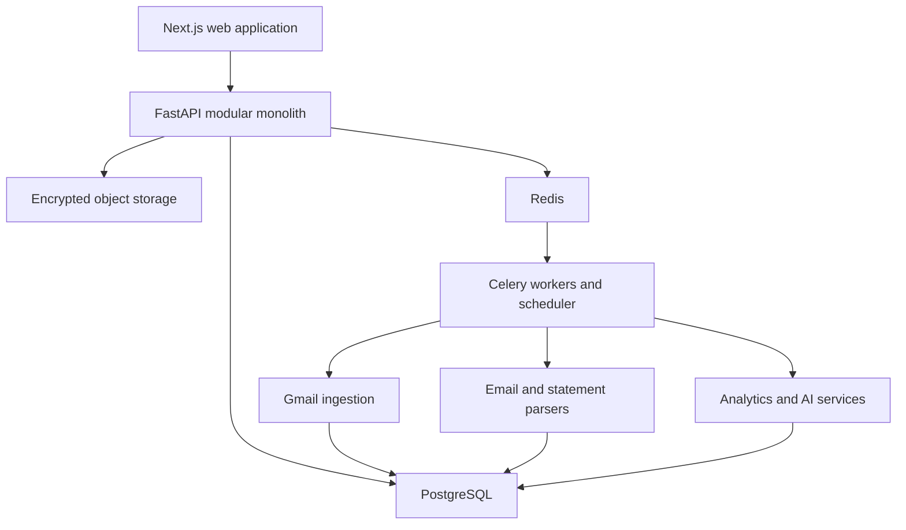
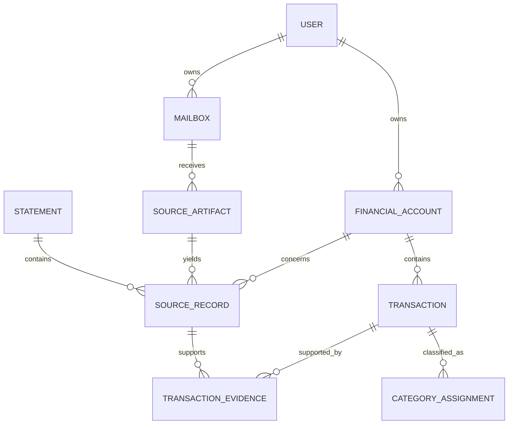
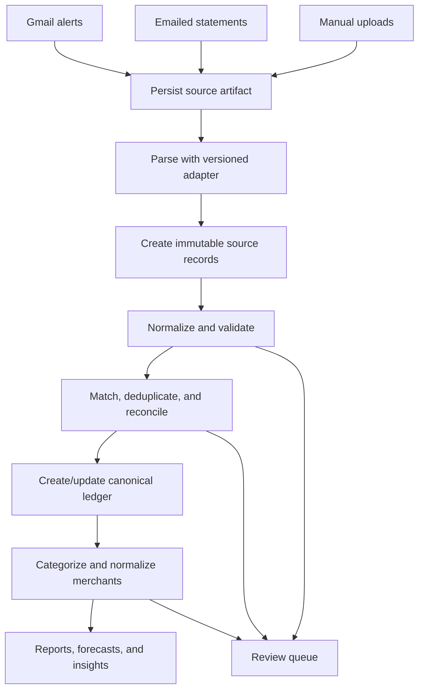

# AI-Powered Personal Finance Tracker

## Project plan

Status: Reviewed implementation baseline  
Working name: Arcis  
Initial audience: Single-user, personal use  
Architecture target: Multi-user capable, read-only financial data platform

The implementation-level companion to this plan is
[ARCHITECTURE.md](./ARCHITECTURE.md). This document owns product scope,
delivery order, and acceptance criteria. `ARCHITECTURE.md` owns runtime
boundaries, data contracts, APIs, security controls, deployment, and
operational behavior. A change to a locked decision must update both documents
before implementation.

## 1. Vision

Arcis will provide one trustworthy place to understand personal cash flow across bank accounts and credit cards. It will collect transaction evidence from Gmail and uploaded statements, normalize institution-specific data, reconcile duplicate observations into a canonical ledger, and produce traceable reports and AI-assisted insights.

The application must answer:

- Where did my money go?
- What payments and bills are coming up?
- Is any transaction missing, duplicated, reversed, or unusual?
- How is this month different from previous months?
- Which source records support each result?

The product is read-only. It will never initiate a bank transfer, card payment, trade, or other financial transaction.

## 2. Guiding principles

1. **Correctness before automation.** A manual import that produces an accurate ledger is more valuable than an automated sync that silently produces incorrect data.
2. **Evidence before inference.** Every canonical transaction and insight must link to its source email, statement entry, or manual record.
3. **Deterministic processing before AI.** Parsing, money calculations, duplicate matching, transfers, and reconciliation should use deterministic logic wherever possible.
4. **AI explains; it does not invent facts.** Models may categorize, summarize, and explain computed results, but financial totals and anomaly candidates come from validated application functions.
5. **Idempotency everywhere.** Repeating a sync, import, parser run, or job must not create duplicate transactions.
6. **Privacy by design.** Collect only required data, retain it deliberately, redact before AI calls, and never log credentials or complete financial documents.
7. **Modular monolith first.** Keep domain boundaries clear while deploying one backend until scale or team structure justifies service separation.
8. **Adapters isolate institutions.** Bank-specific formats must not leak into the core ledger or analytics domain.

### 2.1 Locked MVP decisions

These choices keep the first implementation internally consistent. Phase 0 may
replace one only when a feasibility spike produces evidence that it is unsafe
or impractical.

| Decision | MVP choice | Reason |
| --- | --- | --- |
| Product authority | PostgreSQL canonical ledger | Reports never read directly from email, parser, cache, or AI output |
| Evidence model | Immutable source artifacts/records linked to canonical transactions | Supports replay, audit, deduplication, and parser upgrades |
| Backend shape | FastAPI modular monolith | Clear domain boundaries without premature distributed services |
| Repository | One monorepo for web, API, workers, contracts, migrations, and tests | Allows atomic schema and contract changes |
| User model | One enabled user initially; `user_id` on every owned record | Avoids a later multi-user data migration |
| Authentication | Backend-owned opaque server sessions in secure cookies | Keeps authorization authoritative in the API and avoids browser token storage |
| Public API | Versioned REST under `/api/v1`; OpenAPI-generated frontend types | Provides an explicit, testable contract |
| Async UX | `202 Accepted` plus durable job resource and polling | Simple, recoverable progress reporting for sync/import jobs |
| Worker model | Celery workers and one Celery Beat scheduler through Redis | Separates slow/untrusted parsing and integrations from API requests |
| Files | Encrypted object storage; metadata and hashes in PostgreSQL | Keeps large sensitive artifacts out of database rows |
| Money | Positive `NUMERIC` amount plus direction and ISO currency; never float | Prevents rounding and sign ambiguity |
| Transfers | Two account-local transaction legs joined by a typed relation | Preserves cash flow while preventing double-counted spending |
| AI boundary | Opt-in, structured output, allow-listed analytics tools, no raw statements/email bodies | Keeps calculations deterministic and minimizes disclosure |
| Production target | AWS container deployment with managed PostgreSQL, Redis, object storage, and keys | Matches the learning goal and defines a concrete security boundary |

## 3. Scope

### 3.1 Phase 1 product scope

- One application user, with a data model that includes user ownership from day one.
- Multiple Gmail connections.
- Daily and on-demand mailbox synchronization.
- Bank and credit-card transaction extraction.
- PDF, CSV, and XLSX statement ingestion.
- Statement attachment detection in Gmail.
- Transaction normalization, deduplication, and reconciliation.
- Automatic categorization with manual correction.
- Account, card, transaction, spending, and report views.
- Credit-card statement and due-date reminders.
- Recurring-payment and subscription detection.
- Monthly AI-assisted insights.
- A conversational assistant backed by predefined analytics tools.
- Review queues for uncertain parser, match, and categorization results.

### 3.2 Supported institutions

Bank accounts:

- HDFC Bank
- ICICI Bank
- State Bank of India
- DBS Bank
- Axis Bank
- Union Bank of India

Credit cards:

- ICICI Credit Card
- Amazon Pay ICICI Credit Card
- Kiwi Credit Card — YES Bank
- OneCard — Federal Bank
- HDFC Swiggy Credit Card
- Scapia Travel Credit Card — Federal Bank

Every account and card is a distinct financial account, even when two products share an issuing bank.

### 3.3 Initial institution rollout

Implement and validate adapters in this order:

1. ICICI bank account
2. ICICI credit card
3. Amazon Pay ICICI credit card
4. HDFC bank account
5. HDFC Swiggy credit card
6. Remaining institutions, one adapter at a time

This gives the first release both bank-account and card behavior without multiplying parser formats too early.

### 3.4 Deferred scope

- Stocks, mutual funds, and portfolio history
- Broker integrations
- Production Account Aggregator integration
- Outlook and other email providers
- Family or shared accounts
- Native mobile applications
- Payment initiation

## 4. Recommended MVP

The first usable release should include:

- One user.
- Manual CSV/XLSX import.
- Manual PDF upload for the first supported institutions.
- Multiple Gmail connections.
- ICICI and HDFC account/card adapters.
- Daily synchronization and **Sync Now**.
- A combined transaction ledger.
- Categorization and merchant normalization.
- Statement reconciliation.
- Transfer and credit-card-payment identification.
- Monthly and category charts.
- Credit-card statement and due-date tracking.
- Basic recurring-payment detection.
- A grounded monthly summary.

The MVP is complete only when it can be trusted for a full monthly close. Supporting more institutions is secondary to proving one end-to-end path with high accuracy.

## 5. Product areas

### 5.1 Overview

- Current-month income, expenses, and net cash flow
- Comparison with the previous month
- Category breakdown
- Account and card summary
- Upcoming card payments
- Recent anomalies and review items
- AI-generated highlights with supporting evidence
- Last synchronization status

### 5.2 Transactions

- Combined bank and card ledger
- Debits, credits, purchases, refunds, reversals, transfers, and card payments
- Search, filters, sorting, and pagination
- Category and subcategory
- Normalized merchant and original narration
- Source and reconciliation status
- Confidence and review state
- Manual editing with correction history

### 5.3 Spending

- Category breakdown
- Monthly and category trends
- Merchant-level spending
- Budget versus actual spending
- Recurring versus discretionary spending
- Month-over-month and year-over-year comparisons

Transfers between owned accounts and credit-card bill payments must not count as new expenses.

### 5.4 Accounts

For each bank account:

- Display name and masked account number
- Latest confirmed balance, timestamp, and source
- Income and outgoing cash flow
- Latest transactions
- Last Gmail synchronization
- Last statement reconciliation
- Data-source health

A balance is a dated observation, not assumed to be the current balance.

### 5.5 Credit cards

For each card:

- Masked card number
- Recorded spending for the current cycle
- Statement amount and minimum amount due
- Payment due date and payment status
- Available limit and observation time, when available
- Upcoming reminder
- Latest transactions

### 5.6 Statements and imports

- Upload PDF, CSV, or XLSX files
- Select or infer the financial account
- Supply a PDF password for in-memory processing only
- Preview normalized entries
- Review matched, new, duplicate, and uncertain records
- Confirm or cancel the import
- View import history, parser version, and errors
- Reprocess an artifact with a newer parser without duplicating ledger entries

### 5.7 Insights

- Monthly summary
- Spending anomalies
- Recurring and subscription analysis
- Merchant, amount, and category changes
- Projected month-end spending
- Potential savings opportunities
- Evidence links and user feedback

### 5.8 Finance assistant

Example questions:

- “How much did I spend on food this month?”
- “Compare restaurant expenses for the last six months.”
- “Which category increased the most?”
- “Show transactions above ₹10,000.”
- “Which subscriptions are due next week?”
- “Am I likely to cross ₹1 lakh this month?”
- “Which transactions are not confirmed by a statement?”

The assistant will call allow-listed analytics functions and will not generate or execute unrestricted SQL.

## 6. Architecture

### 6.1 High-level design



### 6.2 Recommended stack

| Area | Technology |
| --- | --- |
| Frontend | Next.js with TypeScript |
| UI | Tailwind CSS and shadcn/ui |
| Charts | Recharts |
| Backend APIs | FastAPI |
| Validation | Pydantic |
| ORM and migrations | SQLAlchemy and Alembic |
| Database | PostgreSQL |
| Background jobs | Celery |
| Scheduling | Celery Beat |
| Job state | PostgreSQL |
| Job broker, locks, and cache | Redis |
| Email integration | Gmail API and Google OAuth |
| PDF extraction | PyMuPDF and pdfplumber |
| Tabular imports | pandas and openpyxl |
| OCR fallback | Tesseract initially; managed document AI only if needed |
| AI | Structured outputs, embeddings, and tool calling |
| Authentication | Backend-owned opaque secure-cookie sessions |
| File storage | S3-compatible local storage; private encrypted S3 in production |
| Testing | pytest, Vitest, and Playwright |
| Observability | OpenTelemetry, structured logs, and job metrics |
| Local environment | Docker Compose |
| CI/CD | GitHub Actions |
| Deployment | AWS during the production-learning phase |

### 6.3 Backend modules

```text
auth
users
mailboxes
financial_accounts
source_artifacts
jobs
transactions
categories
imports
parsers
reconciliation
credit_cards
budgets
analytics
insights
assistant
notifications
audit
privacy
```

These are module boundaries, not separate services.

### 6.4 Institution adapters

```text
EmailParser
├── HDFCEmailParser
├── ICICIEmailParser
├── SBIEmailParser
├── DBSEmailParser
├── AxisEmailParser
└── UnionBankEmailParser

StatementParser
├── HDFCStatementParser
├── ICICIStatementParser
└── ...
```

Every adapter returns versioned, typed parser output. It must not write directly
to reporting tables. Component responsibilities, contracts, APIs, schema,
worker behavior, security, and deployment are defined in
[ARCHITECTURE.md](./ARCHITECTURE.md).

## 7. Core data model

The most important modeling decision is to distinguish source evidence from the canonical ledger.



### 7.1 Principal entities

`users`

- User identity and settings
- Default currency, locale, and timezone

`mailboxes`

- Gmail account identity
- Encrypted refresh-token reference
- Connection state and granted scopes
- Gmail history cursor
- Last attempted and successful sync
- Parser statistics and sync health

`financial_accounts`

- Owner and account type
- Institution and product
- Stable internal account identifier
- Masked account/card digits
- Currency, status, and statement-cycle metadata

`source_artifacts`

- Email, attachment, or manual upload metadata
- Provider message ID or content fingerprint
- Encrypted object reference
- Import state, parser name, and parser version
- Retention and deletion state

`source_records`

- Immutable normalized observations extracted from artifacts
- Source-local identifier and fingerprint
- Raw normalized fields and confidence
- Parse warnings and provenance

`transactions`

- Canonical economic events used for the ledger and reporting
- Financial account, dates, amount, direction, currency
- Normalized merchant and original narration
- Reference number, category, and review state
- Reconciliation status

`transaction_evidence`

- Link between canonical transactions and one or more source records
- Match method, score, decision, and reviewer

`statements`

- Account and statement period
- Opening/closing balance
- Statement amount, minimum due, and due date
- Import and reconciliation status

`balance_observations`

- Account, balance, observation time, source, and confidence

`jobs`

- Sync/import job state, progress, counters, error category, and retry data

`audit_events`

- Actor, action, target, timestamp, request/correlation ID, and safe metadata

### 7.2 Money and time rules

- Never use binary floating-point for money. Use PostgreSQL `NUMERIC` and Python `Decimal`, with explicit currency.
- Preserve both transaction date and posted date.
- Store instants in UTC and retain the user's financial timezone for date boundaries.
- Treat statement-cycle dates separately from calendar months.
- Do not combine currencies in totals unless an explicit exchange-rate policy is implemented.

## 8. Ingestion and processing

### 8.1 Pipeline



### 8.2 Gmail synchronization

Each mailbox is connected independently through OAuth and has its own cursor and health state.

Synchronization modes:

- Daily scheduled synchronization
- Asynchronous **Sync Now** for one mailbox or all mailboxes

Every sync returns understandable counters, for example:

> 35 emails scanned, 12 transactions added, 4 duplicates ignored, 2 statements detected, and 1 email sent for review.

Required behavior:

- Query only relevant senders, subjects, and date ranges where possible.
- Use provider message IDs as one idempotency layer.
- Advance the history cursor only after safely recording processed artifacts.
- Recover from expired cursors with a bounded rescan.
- Prevent concurrent syncs for the same mailbox with a distributed lock.
- Make retries safe.
- Store unsupported messages as metadata plus a protected review reference, subject to retention policy.

### 8.3 Statement ingestion

Structured CSV/XLSX import should precede PDF support because it is easier to validate.

Statements may provide:

- Period
- Opening and closing balances
- Transactions
- Statement amount
- Minimum payment
- Due date
- Credit and available limits

For protected PDFs, the password is supplied over TLS, held only as long as the processing job requires, excluded from logs and job payloads, and never persisted.

OCR is a fallback, not a default. OCR-derived fields require lower confidence and stronger review behavior.

### 8.4 Import lifecycle

```text
uploaded → scanning → parsing → preview_ready → confirmed → reconciled
                                 ↘ failed
                                 ↘ cancelled
```

Confirmation creates or links canonical transactions in a single database transaction. Reconfirming the same import is idempotent.

## 9. Deduplication and reconciliation

Transactions must never be matched on amount alone.

Matching features:

- User and financial account
- Direction
- Amount and currency
- Exact or nearby transaction/posted date
- Reference number
- Normalized merchant
- Narration similarity
- Source and provider identifiers
- Reversal or refund relationship

Reconciliation states:

- `email_only`
- `statement_only`
- `statement_confirmed`
- `potential_duplicate`
- `reversed`
- `needs_review`

Recommended matching approach:

1. Exact match on stable source or reference identifier.
2. Deterministic composite match on account, amount, direction, and date window.
3. Scored fuzzy match using merchant and narration similarity.
4. Manual review below the automatic-accept threshold.

Match decisions must retain the rule/model version and score so they can be audited and reevaluated.

Transfers and card payments require paired-transaction logic:

- Link the outgoing bank transaction to the incoming account/card payment.
- Mark the pair as a transfer or liability payment.
- Exclude it from spending totals while preserving it in cash-flow views.

## 10. Categories

Initial categories:

- Food and Dining
- Groceries
- Shopping
- Bills and Utilities
- Rent and Housing
- Travel
- Transportation
- Entertainment
- Healthcare
- Education
- Insurance
- EMI and Loans
- Investments
- Transfers
- Cash Withdrawal
- Salary and Income
- Refunds
- Fees and Charges
- Gifts and Donations
- Other

Users can create categories and subcategories. System categories used for transfer, refund, and card-payment semantics should have protected identifiers even if display names are customizable.

## 11. AI and intelligent features

### 11.1 Hybrid categorization

Apply classifiers in this order:

1. User-defined rule
2. Known merchant mapping
3. Historical user corrections
4. Embedding or conventional classifier
5. LLM fallback with structured output
6. Manual review

Every assignment stores its source, confidence, and model/rule version. User corrections override inferred assignments and become evaluation examples; they should not immediately retrain a model without a controlled evaluation step.

### 11.2 Merchant normalization

Descriptions such as:

```text
SWIGGY
WWW.SWIGGY.IN
RAZORPAY*SWIGGY
UPI-SWIGGY
```

should resolve to a merchant entity such as `Swiggy`, while retaining the original narration.

### 11.3 Recurring-payment detection

Detect subscriptions, rent, utilities, premiums, EMIs, SIPs, and regular transfers using:

- Merchant similarity
- Expected interval
- Amount tolerance
- Sufficient historical occurrences
- User confirmation

A recurrence is a prediction with confidence, not a guaranteed future bill.

### 11.4 Anomaly detection

Generate anomaly candidates deterministically or statistically:

- Unusually large transaction
- Duplicate charge
- Subscription price increase
- New or unexpected merchant
- Category spike
- Abnormally high bill

The LLM may explain candidates in plain language but must not create unsupported anomaly facts.

### 11.5 Forecasting

- Expected month-end spending
- Budget-crossing likelihood
- Upcoming recurring expenses
- Expected card statement amount
- Short-term cash-flow gap

Forecast output must include the method, data window, uncertainty, and last calculation time.

### 11.6 Monthly review

Example:

> You spent ₹84,200 this month, 11% more than last month. Food delivery increased by ₹3,800, while travel decreased by ₹6,200. Two recurring subscriptions increased in price.

Each figure and claim links to the query result or transactions that support it.

### 11.7 Assistant tool boundary

Initial allow-listed tools:

```text
get_spending_by_category
compare_periods
find_large_transactions
list_upcoming_bills
get_recurring_payments
forecast_month_end_spend
list_unreconciled_transactions
```

Tool input must include user ownership context enforced by the backend, not supplied solely by the model. Apply result-size limits, date validation, authorization checks, and audit logging.

### 11.8 Feedback and evaluation

Feedback:

- Correct / incorrect
- Expected / unexpected
- Useful / not useful

Evaluation datasets:

- Sanitized parser fixtures
- User-corrected categories
- Merchant aliases
- Known duplicate and non-duplicate pairs
- Reconciliation decisions
- Confirmed anomaly candidates

Metrics:

- Parser field accuracy by institution/template/version
- Categorization precision, recall, and coverage
- Merchant-normalization accuracy
- Duplicate-match precision and recall
- Statement-reconciliation accuracy
- Anomaly precision and user acceptance
- Assistant tool-selection and answer-grounding accuracy

## 12. Security and privacy

### 12.1 Required controls

- Gmail OAuth only; never collect Gmail passwords.
- Request the minimum Gmail permission needed.
- Encrypt refresh tokens with a managed key and support key rotation.
- Mask account and card numbers throughout the UI and logs.
- Never log tokens, statement passwords, raw email bodies, or full documents.
- Keep statement processing inside trusted backend infrastructure.
- Redact and minimize content before any external AI request.
- Enforce user ownership in every query and background job.
- Record security-sensitive actions in an append-only audit trail.
- Use HTTPS, secure cookies, CSRF protection, and session expiration.
- Provide Gmail disconnect, token revocation guidance, export, and deletion.
- Keep production databases and object storage private and encrypted.
- Scan uploaded files, validate declared and detected file types, and impose size/page limits.

### 12.2 Decisions required during foundation

- Authentication and session design
- Token and document encryption approach
- Raw email/document retention periods
- Backup retention and restore procedure
- Whether raw source content is stored or only extracted fields are retained
- AI provider data handling and opt-out behavior
- Audit-log retention
- Personal Google OAuth testing versus verification requirements if access expands

### 12.3 Threat model

Before Gmail integration, document at least:

- Stolen OAuth refresh token
- Session hijacking
- Cross-user data access
- Malicious file upload or parser exploit
- Sensitive data leakage through logs, traces, or AI prompts
- Prompt injection contained in email or statement text
- Duplicate jobs and partial processing
- Incorrect reconciliation changing financial reports
- Backup or object-storage exposure

## 13. Observability and operations

Use correlation IDs across API requests, jobs, artifacts, and parser runs.

Track:

- Sync attempts, duration, cursor age, and failures
- Emails discovered and artifacts persisted
- Parser success by institution, template, and version
- Review-queue volume and age
- Import and reconciliation counts
- Duplicate and match decision distributions
- Job retries, dead-lettered work, and queue lag
- Assistant latency, tool failures, and token/cost budgets
- AI redaction and structured-output failures

Logs must use safe identifiers rather than financial narration or document contents.

## 14. Testing strategy

### 14.1 Unit tests

- Parser fixtures for every known email and statement template
- Amount, date, direction, and currency normalization
- Deduplication and reconciliation rules
- Transfer and card-payment pairing
- Categories, budgets, and report calculations
- Redaction and masking

### 14.2 Contract and integration tests

- Adapter output against the common schema
- Gmail sync cursor and retry behavior
- Import transactionality and idempotency
- PostgreSQL ownership enforcement
- Worker retry and dead-letter behavior
- AI structured-output validation and tool authorization

### 14.3 End-to-end tests

- Upload → preview → confirm → dashboard
- Gmail connect → sync → ledger
- Statement import → reconciliation → review
- Manual correction → updated reports
- Assistant question → authorized tool → evidence-linked response
- Disconnect/delete workflows

### 14.4 Golden datasets

Maintain sanitized golden fixtures with expected parser output. A parser change cannot ship if it causes unexplained regressions. Store expected matches and reports alongside fixtures for repeatable evaluation.

## 15. Delivery plan

### Phase 0 — Discovery and foundation

Work:

- Collect sanitized sample emails and statements.
- Catalogue sender addresses, subjects, templates, and date/amount formats.
- Finalize source-evidence and canonical-ledger schemas.
- Define category taxonomy and money/time rules.
- Create wireframes for import review, transactions, and dashboard.
- Set up the monorepo, Docker Compose, PostgreSQL, Redis, and CI.
- Establish authentication, encryption, redaction, retention, and logging rules.
- Create the Google Cloud project and development OAuth configuration.
- Create sanitized golden fixtures and a parser test harness.
- Create the monorepo layout and versioned API/parser contracts described in
  `ARCHITECTURE.md`.
- Prove the critical external and data-integrity boundaries before building
  feature breadth:
  1. Parse one ICICI structured statement into source records and replay it
     without creating another canonical expense.
  2. Connect two test Gmail mailboxes, run initial and incremental sync, and
     recover from an invalid/expired history cursor with a bounded overlap.
  3. Encrypt, decrypt, rotate, and revoke a test OAuth credential without
     exposing plaintext in database rows, logs, traces, or job arguments.
  4. Process a password-protected PDF in an isolated parser subprocess and prove the
     password is absent from persistence, broker payloads, and telemetry.
  5. Retry a deliberately interrupted import and reconciliation job and prove
     that artifact, source-record, evidence, and canonical-transaction counts
     remain correct.
  6. Generate the frontend client from the OpenAPI document and fail CI on
     uncommitted contract drift.
- Record the commands, fixture identifiers, component versions, results, and
  plan corrections from every feasibility proof.

Completion criteria:

- Architecture decision records cover the critical security and data-model choices.
- Local development and test environments work from documented commands.
- The first sanitized fixture set is versioned.
- The normalized parser contract is stable enough for the first adapters.
- No secret or real financial content is committed to source control.
- Every numbered feasibility proof passes; unresolved proof failures block
  Phase 1.
- The OpenAPI schema, database migration baseline, and parser contract are
  versioned and reproducible from a clean checkout.

### Phase 1 — Trustworthy manual ledger

Work:

- Authentication and user ownership.
- Financial-account management.
- Categories, merchants, and user rules.
- Manual transaction creation and editing.
- CSV/XLSX import with mapping, preview, and confirmation.
- Combined ledger with filters.
- Basic monthly dashboard and reports.
- Exact and fuzzy duplicate detection.
- Transfer and credit-card-payment identification.
- Audit history for corrections.

Completion criteria:

- A user can import a full month, resolve review items, and obtain correct totals.
- Reimporting the same file creates no duplicate expenses.
- Transfer and card-payment fixtures do not inflate spending.
- All ledger rows link to evidence or an explicit manual entry.

### Phase 2 — Gmail automation

Work:

- Connect multiple Gmail accounts through OAuth.
- Maintain independent mailbox cursors.
- Discover and persist relevant emails idempotently.
- Implement first ICICI and HDFC email parsers.
- Add **Sync Now** and scheduled daily sync.
- Show progress, counters, health, and actionable errors.
- Add a safe unsupported-message review queue.
- Add parser metrics, retries, and dead-letter handling.

Completion criteria:

- Supported new transactions appear automatically.
- Repeated and concurrent sync requests do not duplicate data.
- Interrupted syncs recover without skipping recorded messages.
- Parser performance is measurable by template and version.

### Phase 3 — PDF statements and reconciliation

Work:

- Manual PDF upload and protected-PDF workflow.
- Extract PDF attachments from Gmail.
- Build versioned institution-specific statement parsers.
- Add statement preview and confirmation.
- Match email records to statement entries.
- Add missing statement-only transactions.
- Detect duplicates, refunds, and reversals.
- Build an uncertain-match review screen.
- Extract balances, statement amount, minimum due, and due date.

Completion criteria:

- A supported monthly statement can close the ledger without duplicate expenses.
- Automatic matches meet the agreed precision threshold.
- Uncertain matches are never silently accepted.
- Reprocessing a statement with a newer parser is safe and auditable.

### Phase 4 — Intelligence

Work:

- Merchant normalization.
- Hybrid categorization and confidence.
- Correction feedback.
- Recurring-payment and subscription detection.
- Anomaly candidate generation.
- Month-end forecast.
- Grounded monthly report.
- Tool-backed conversational assistant.
- Evaluation datasets and quality dashboard.

Completion criteria:

- All generated claims are traceable to computed facts.
- Low-confidence classifications enter review.
- Evaluation runs are repeatable and versioned.
- User corrections improve rule coverage without silently changing history.

### Phase 5 — Budgets, reminders, and polish

Work:

- Shared reporting-period framework: all time, current/previous month, recent
  periods, and current year. A selected period must affect every relevant
  report, chart, ledger view, budget calculation, and insight consistently.
  Persist the preference only within the authenticated user profile; never use
  browser storage as the source of truth.
- Monthly and category budgets.
- Card due-date reminders.
- Dedicated recurring and subscription management, including confirmed,
  detected, dismissed, and restored patterns; next expected date; and monthly
  and annual commitment totals.
- Upcoming recurring-expense timeline.
- In-app and email notifications.
- Document vault showing uploaded and Gmail-detected source files, source and
  parser state, safe review status, and links only to authorized metadata.
- Responsive UI and accessibility: keyboard-safe dialogs, visible focus,
  readable body text, mobile touch targets, and verified desktop/tablet/mobile
  layouts.
- Dashboard caching and incremental loading.
- Pagination and background report generation.
- Privacy controls: data export, mailbox/account/source deletion, configurable
  retention, and tested backup-restore/deletion workflows.
- Performance, recovery, and security testing.
- Release verification using realistic sanitized fixtures and critical browser
  flows for imports, duplicate detection, reconciliation, Gmail recovery,
  recurring review, and privacy controls.

Completion criteria:

- The app is reliable for everyday use.
- Notification retries cannot create repeated reminders.
- Several years of transactions remain responsive.
- All selected-period views produce consistent totals from the same source
  transactions.
- Restore, export, and deletion procedures have been exercised.
- Key workflows meet accessibility and responsive acceptance gates.

### Phase 6 — Investments and wealth tracking

Work:

- One broker adapter.
- Mutual-fund consolidated statement import.
- Holdings and daily portfolio snapshots.
- Realized and unrealized return calculations.
- Asset allocation and benchmark comparison.
- Investment summaries.

Completion criteria:

- Cash-flow data and investment data remain distinct but reconcilable.
- Returns can be reproduced from recorded positions, transactions, and prices.

### Phase 7 — Account Aggregator and productization

Work:

- Finvu or Setu sandbox adapter.
- Consent creation and periodic data-fetch demonstration.
- Common Account Aggregator interface.
- Regulated-FIU partnership evaluation.
- Hardened multi-user tenant isolation.
- Consent, privacy, and retention controls.
- Production security review.
- Outlook only if justified by demand.

This phase is optional unless the application becomes a product.

## 16. Initial implementation backlog

The first four development iterations should be small vertical slices:

### Iteration 1 — Foundation

- Repository layout and local environment
- Database migrations
- User and financial-account models
- Authentication skeleton
- Safe configuration and structured logging
- Parser contract and test harness

### Iteration 2 — First import

- ICICI CSV/XLSX adapter
- Artifact and source-record persistence
- Preview and confirm flow
- Canonical transaction creation
- Ledger UI
- Idempotency test

### Iteration 3 — Trust and reporting

- Duplicate scoring
- Reconciliation evidence links
- Transfer/card-payment pairing
- Categories and correction history
- Monthly totals and category chart

### Iteration 4 — Second adapter

- HDFC structured-statement adapter
- Adapter conformance tests
- Import review improvements
- Cross-adapter regression suite

Only after these slices are reliable should Gmail OAuth and automated ingestion begin.

## 17. Success metrics

### Data quality

- At least 95% field-level accuracy for supported transaction email templates.
- Near-100% precision is prioritized for automatic duplicate/reconciliation matches; uncertain cases go to review.
- Reimport and resync operations create zero additional canonical expenses.
- Credit-card payments and owned-account transfers do not inflate expense totals.
- All reported totals are reproducible from the canonical ledger.

### AI quality

- Categorization accuracy and automatic-coverage rate are measured separately.
- Merchant normalization is evaluated on a versioned dataset.
- Every insight links to supporting transactions or aggregate query results.
- Anomaly precision is tracked from user feedback.
- Assistant responses use authorized tools and pass grounding checks.

### Reliability and security

- Daily synchronization is idempotent, observable, and recoverable.
- No token, password, raw email body, full document, or unmasked account number appears in logs.
- Backup restoration is tested.
- Data export, Gmail disconnect, and deletion workflows are functional.
- The dashboard meets an agreed response-time target on a multi-year dataset.

## 18. Major risks and mitigations

| Risk | Impact | Mitigation |
| --- | --- | --- |
| Bank email/statement formats change | Parser failures or wrong data | Version adapters, golden fixtures, template detection, metrics, and review queue |
| Duplicate observations become duplicate expenses | Incorrect totals | Separate evidence from ledger, idempotency keys, conservative match thresholds |
| Gmail OAuth complexity expands | Delayed automation or access restrictions | Prove manual ledger first; document scopes and verification path early |
| PDFs are inconsistent or scanned | Low extraction accuracy | Prefer structured files, institution adapters, confidence, OCR fallback, review |
| Transfers/card payments are counted twice | Inflated spending | Explicit transaction semantics and paired-transfer model |
| LLM exposes or fabricates financial details | Privacy or trust failure | Redaction, minimal prompts, structured output, allow-listed tools, evidence links |
| User corrections overwrite provenance | Lost auditability | Immutable source records and versioned correction history |
| Background retries create inconsistent state | Duplicates or skipped data | Transactional writes, stable idempotency keys, locks, resumable cursors |
| Scope grows across institutions too early | Slow delivery and weak quality | Finish one monthly-close path before adding adapters |

## 19. Open decisions

Resolve these during Phase 0:

1. Python and TypeScript package managers within the locked monorepo layout.
2. Raw artifact retention period and user-configurable retention behavior.
3. Local-development encryption-key storage consistent with the production key interface.
4. Exact Gmail query and minimum OAuth scope.
5. Import mapping UX for inconsistent CSV/XLSX columns.
6. Automatic-match and categorization confidence thresholds after fixture calibration.
7. Base currency behavior and whether multi-currency conversion is deferred.
8. Notification provider and reminder timezone policy.
9. AWS cost ceiling, region, and initial availability target.
10. AI provider/model data-retention policy and per-feature opt-out.
11. Whether row-level security is mandatory in the single-user release or becomes a pre-multi-user release gate.

## 20. Documentation and execution protocol

Before implementation begins, add:

- `docs/NEXT.md`: a stable, numbered checkbox ledger derived from the delivery
  plan. Complete work in order and never silently renumber existing task IDs.
- `docs/STATUS.md`: decisions, current phase, completed work, exact verification
  commands/results, schema migrations, and deviations from this plan.
- `docs/adr/`: short architecture decision records for decisions that are hard
  to reverse, including authentication, raw-artifact retention, encryption,
  Gmail scope, reconciliation thresholds, and production topology.

For each implementation task:

1. Read this plan, `ARCHITECTURE.md`, `STATUS.md`, and `NEXT.md`.
2. Complete only the first unblocked task or explicitly record why sequencing
   changed.
3. Run the relevant tests and record evidence in `STATUS.md`.
4. Mark the `NEXT.md` checkbox complete only after acceptance criteria pass.
5. Update the plan and architecture before changing a locked product boundary,
   durable contract, security boundary, or data invariant.

## 21. Definition of done

A feature is done when:

- Its user-visible behavior and failure states are implemented.
- Authorization and ownership checks are enforced.
- Idempotency and retry behavior are defined where applicable.
- Unit and relevant integration/end-to-end tests pass.
- Logs, metrics, and audit events are safe and useful.
- Sensitive data handling has been reviewed.
- Documentation and migrations are included.
- The feature has been exercised with sanitized realistic fixtures.
